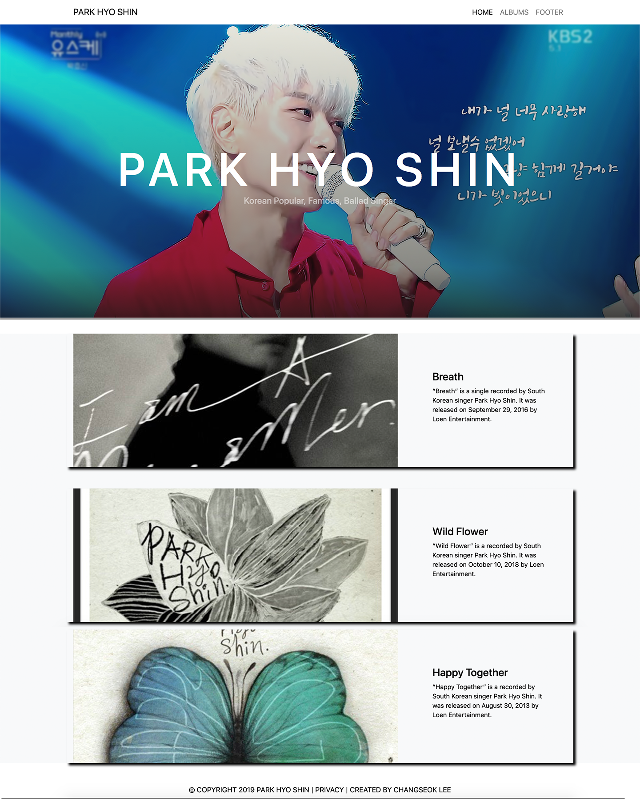

# MY FAVOURITE THINGS

The project idea was to pick 3 related things I love and create an app to showcase them.

Park Hyo Shin is my Legend, so it was an easy choice.

Used Node and Express to generate the app; used Handlebars as template / view
engine and require data via mysql. Github repo that
is also integrated with Heroku to host and deploy app (host on Heroku, manage it
on Github, continuously deploy it to Heroku).

## Notes
- to start the app in Terminal, use `npm start` (node server and gulp sass watch will start)
- localhost:3000 is gonna be a port for this project

## Tools used during development phase:

- Adobe Illustrator, Photoshop
- SASS
- Node.js
- mySql
- https://expressjs.com/
- https://handlebarsjs.com/
